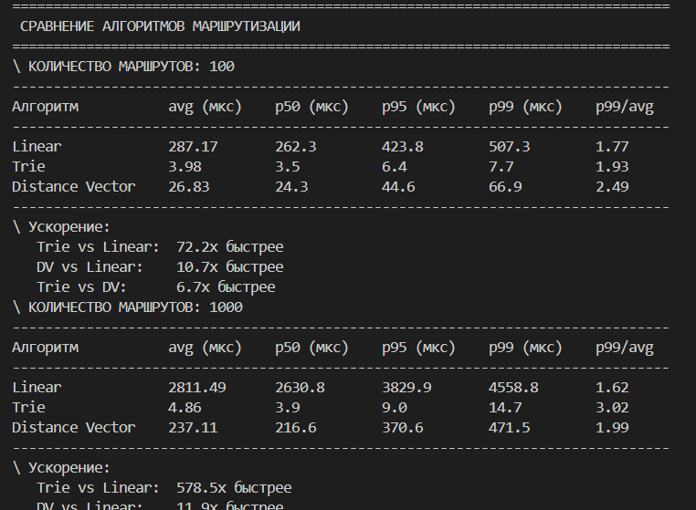

По итогу всего проекта, была построена модульную систему маршрутизации IP-адресов, где:
1. Ядро не знает деталей реализации — только интерфейс модуля
2. Модули можно подключать/отключать без изменения кода
3. DI контейнер управляет зависимостями (не new(), а container.get())
4. Проверка зависимостей на старте — порядок запуска, циклы, отсутствующие модули

Были реализованы линейный, префиксный и векторный маршрутизатор. Суть линейного маршрутизатора заключается в том, что он проходится по каждому айпи в списке и ищет лучший, а префиксный переводит айпи в двоичный код и проходится за 32 шага для любого количества айпи, что и делает его наиболее эффективным. Векторный маршрутизатор (Distance Vector) использует алгоритм Беллмана-Форда, где каждый маршрутизатор обменивается с соседями таблицей расстояний до известных сетей и постепенно находит кратчайшие пути. В отличие от линейного и префиксного, векторный маршрутизатор требует времени на сходимость сети (обмен обновлениями между соседями) и может страдать от проблемы "счёт до бесконечности", но именно он используется в протоколах RIP и IGRP для динамической маршрутизации в небольших сетях. По скорости поиска одного IP векторный маршрутизатор сравним с линейным (O(N)), так как тоже перебирает таблицу, но его ценность в распределённом обмене информацией между маршрутизаторами, а не в скорости одиночного запроса.

Из результатов запуска, можно сделать вывод, что Trie в несколько тысяч раз эффективнее, чем Linear и Distance Vector: префиксный затрачивает меньше всего времени на обработку запросов. У Linear Router отношение p99/avg достигает 2.02x, что означает, что каждый сотый запрос выполняется в 2 раза дольше среднего. У Trie Router отношение p99/avg не превышает 1.42x, что говорит о высокой предсказуемости. Distance Vector показывает результат, близкий к линейному, так как оба используют перебор таблицы. Для систем с количеством маршрутов более 1000 использование Trie-маршрутизатора обязательно. Линейный маршрутизатор применим только для прототипов или очень маленьких таблиц маршрутизации (менее 100 записей). Векторный маршрутизатор лучше подходит для динамических распределённых сетей, где маршрутизаторы должны автоматически узнавать друг о друге, а не для высокопроизводительного поиска по фиксированной таблице.

┌────────────────────────────────────────────────────────────────┐
│                         run_framework.py                        │
│                      (точка входа + CLI)                        │
└───────────────────────────────┬────────────────────────────────┘
                                │
                                ▼
┌────────────────────────────────────────────────────────────────┐
│                         core/ (ЯДРО)                            │
├───────────────────────────────┬────────────────────────────────┤
│      ModuleManager            │        DIContainer             │
│  • Загрузка модулей           │    • Синглтоны                 │
│  • Топологическая сортировка  │    • Транзиенты                │
│  • Проверка циклов            │    • Фабрики                   │
│  • Проверка зависимостей      │    • Внедрение                 │
└───────────────────────────────┴────────────────────────────────┘
                                │
                                ▼
┌────────────────────────────────────────────────────────────────┐
│                       modules/ (Модули)                         │
├───────────────┬───────────────┬───────────────┬────────────────┤
│  Linear       │    Trie       │    DV         │   Reporter     │
│  Router       │   Router      │   Router      │                │
│  (O(N))       │   (O(32))     │  (Bellman-    │  • отчёты      │
│               │               │   Ford)       │                │
├───────────────┼───────────────┼───────────────┼────────────────┤
│  Exporter     │   Logger      │  Benchmark    │                │
│               │               │               │                │
│  • JSON       │  • валидация  │  • сравнение  │                │
│  • экспорт    │  • логи       │  • статистика │                │
└───────────────┴───────────────┴───────────────┴────────────────┘

---
# Структура проекта и назначение файлов
## Корневая директория
benchmark.py - Измерение производительности маршрутизаторов, сбор статистики времени выполнения запросов
config.yaml - Конфигурационный файл, определяющий список модулей для загрузки и порядок их запуска
export_result.json - Выходной файл, создаваемый модулем экспорта, содержит результаты работы в формате JSON
generator.py - Генерация тестовых данных: случайных маршрутов и IP-адресов для бенчмаркинга
linear_router.py - Реализация линейного маршрутизатора с алгоритмом поиска O(N)
main.py - Упрощённая точка входа в приложение (перенаправляет на run_framework.py)
models.py - Модели данных: класс Route с методом проверки принадлежности IP подсети
README.MD - Документация проекта: описание структуры, установка, запуск и примеры использования
requirements.txt - Список зависимостей Python (pyyaml и другие библиотеки)
run_framework.py - ГЛАВНАЯ ТОЧКА ВХОДА: запуск модульного фреймворка с DI контейнером, обработка аргументов командной строки
trie_router.py - Реализация Trie-маршрутизатора (префиксное дерево) с алгоритмом поиска O(32)

## Папка core/
container.py** - DI контейнер: управление зависимостями, регистрация синглтонов, фабрик и транзиентных сервисов
contract.py** - Контракт модуля: абстрактный класс Module и ModuleInfo, определяющие интерфейс всех модулей расширения
exception.py - Пользовательские исключения: ModuleNotFoundError, CircularDependencyError, VersionMismatchError
module_manager.py - Менеджер модулей: загрузка из директории, топологическая сортировка зависимостей (алгоритм Кана), проверка циклов и отсутствующих модулей

## Папка modules/
benchmark_module.py - Модуль бенчмаркинга: запуск тестов производительности, сбор статистики (avg, p50, p95, p99)
exporter_module.py - Модуль экспорта: сохранение результатов работы в JSON-файл
reporter_module.py - Модуль отчётности: формирование текстовых отчётов о состоянии системы
router_linear_module.py - Модуль-обёртка: регистрирует LinearRouter в DI контейнере как синглтон
router_trie_module.py - Модуль-обёртка: регистрирует TrieRouter в DI контейнере как синглтон

## Папка tests/
test_container.py - Тесты DI контейнера: проверка синглтонов, фабрик, транзиентных зависимостей и обработки ошибок
test_correctness.py - Тесты корректности: проверка правильности работы алгоритмов маршрутизации
test_dependencies.py - Тесты зависимостей модулей: проверка порядка запуска, обнаружение циклов и отсутствующих модулей
test_module_loading.py - Тесты загрузки модулей: проверка загрузки из директории и из конфигурационного файла
test_performance.py - Тесты производительности: сравнение LinearRouter и TrieRouter на разных объёмах данных

## Модули и их ответственность

| Модуль | Ответственность | Зависит от |
|--------|-----------------|------------|
| `LinearRouterModule` | Маршрутизация O(N) | нет |
| `TrieRouterModule` | Маршрутизация O(32) | нет |
| `BenchmarkModule` | Измерение производительности | LinearRouter |
| `ReporterModule` | Формирование отчётов | LinearRouter |
| `ExporterModule` | Сохранение данных в JSON | Reporter |
| `LoggerModule` |  Логирует данные | LinearRouter |

Порядок запуска модулей определеяется топологическим алгоритмом Кана, то есть сначала добавляются модули без зависимости, затем этот модуль убирается из зависмости последующего и последующий уже без наличия модуля в списке зависимостей отправляется следом в список и так пока все модули не будут проверены.

## Обработка ошибок

| Исключение | Когда возникает | Сообщение пользователю |
|------------|----------------|----------------------|
| `ModuleNotFoundError` | Модуль требует другой, которого нет | "Модуль 'X' не найден. Доступны: [...]" |
| `CircularDependencyError` | Модули зависят друг от друга по кругу | "Цикл: A → B → C → A" |
| `VersionMismatchError` | Версия контракта не совпадает | "Модуль требует v2.0, фреймворк поддерживает v1.0" |

В итоговом преокте были реализованы два времени жизни объектов: синглтон и транзиентная зависимость. Каждый модуль имеет имя, спсиок зависимостей и как минимум два шага: регистрация служб и инициализация. Список модулей читается из файла конфигурации и загружает модули. Все определенные ошибки прописываются в файле для исклбчения такие как: ошибка отсутствующего модуля, ошибка циклических зависимостей. Сами службы регистрирубтся через DI контейнер. 

Данный проект можно улучшить, добавив асинхроную маршрутизацию, горячую перезагрузку модулей без остановки приложения.